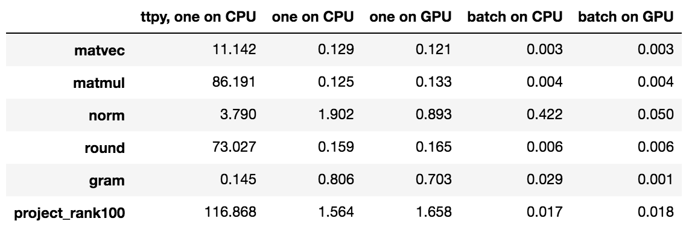

[](https://travis-ci.org/Bihaqo/t3f)
[](https://coveralls.io/github/Bihaqo/t3f?branch=develop)

TensorFlow implementation of the Tensor Train (TT) -Toolbox.

# API
API is available via [readthedocs](https://t3f.readthedocs.io/en/latest/).

# Installation
T3f assumes you have Python 2.7, 3.4, 3.5, or 3.6 and a working TensorFlow installation, tested versions are from 1.0 to 1.11 (see [here](https://www.tensorflow.org/install/) for TF installation instructions).
We don't include it into pip requirements since the installation of TensorFlow varies depending on your setup.
Then simply run
```bash
pip install t3f
```

# Basic usage
Import the libraries
```python
import tensorflow as tf
import t3f
```

Generate a random tensor and compute its norm.
```python
# Create a random tensor of shape (3, 2, 2).
a = t3f.random_tensor((3, 2, 2), tt_rank=3)
norm = t3f.frobenius_norm(a)
# Convert TT-tensor into a dense tensor for printing.
a_full = t3f.full(a)
# Run a tensorflow session to run the operations.
with tf.Session() as sess:
  # Run the operations. Note that if you run these
  # two operations separetly (sess.run(a_full), sess.run(norm))
  # the result will be different, since sess.run will
  # generate a new random tensor a on each run because `a' is
  # an operation 'generate me a random tensor'.
  a_val, norm_val = sess.run([a_full, norm])
  print('The norm is %f' % norm_val)
  print(a_val)
```

### Arithmetic
```python
a = t3f.random_tensor((3, 2, 2), tt_rank=3)
b_dense = tf.random_normal((3, 2, 2))
# Use TT-SVD on b_dense.
b_tt = t3f.to_tt_tensor(b_dense, max_tt_rank=4)
sum_round = t3f.round(t3f.add(a, b_tt), max_tt_rank=2)
```

### Tensor operations
```python
# Inner product (sum of products of all elements).
a = t3f.random_tensor((3, 2, 2), tt_rank=3)
b = t3f.random_tensor((3, 2, 2), tt_rank=4)
inner_prod = t3f.flat_inner(a, b)
```

### Matrix operations
```python
A = t3f.random_matrix(((3, 2, 2), (2, 3, 3)), tt_rank=3)
b = t3f.random_matrix(((2, 3, 3), None), tt_rank=3)
# Matrix-by-vector
matvec = t3f.matmul(A, b)

# Matrix-by-dense matrix
b_dense = tf.random_normal((18, 1))
matvec2 = t3f.matmul(A, b_dense)
```
# More examples
For more examples (e.g. how to build neural networks or how to do Riemannian optimization) see ```examples``` folder.

# Citing
If you use T3F in your research work, we kindly ask you to cite [the paper](https://arxiv.org/abs/1801.01928) describing this library
```
@article{novikov2018tensor,
  title={Tensor Train decomposition on TensorFlow (T3F)},
  author={Novikov, Alexander and Izmailov, Pavel and Khrulkov, Valentin and Figurnov, Michael and Oseledets, Ivan},
  journal={arXiv preprint arXiv:1801.01928},
  year={2018}
}
```

# Benchmarking
Here are the results im ms of benchmarking T3F on CPU and GPU and comparing against the [TTPY library](https://github.com/oseledets/ttpy)


For more details see ```examples/profile``` folder.

# Tests
```bash
nosetests  --logging-level=WARNING
```

# Building API documentation
The documentation is build by sphinx and hosted on readthedocs.org. To rebuild the documentation, install sphinx and compile the docs by
```bash
cd docs
make html
```

# Other implementations
There are also implementations of the TT-toolbox in [plain Python](https://github.com/oseledets/ttpy) and [Matlab](https://github.com/oseledets/TT-Toolbox).
