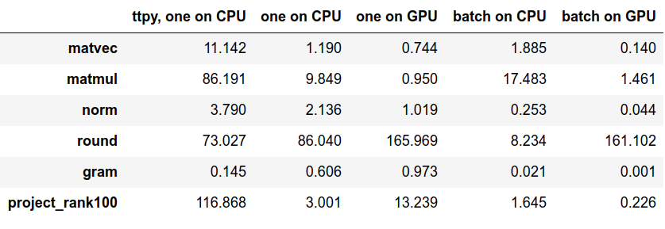

## Benchmarking T3F
To benchmark the library, use the following commands
```bash
# Running on CPU.
CUDA_VISIBLE_DEVICES= python benchmark.py --file_path logs_cpu.pkl
# Running on GPU.
CUDA_VISIBLE_DEVICES=0 python benchmark.py --file_path logs_gpu.pkl
```
To visualize the results in a table, see ```results.ipynb``` Jupyter notebook.
Here are the numbers you can get on NVIDIA DGX-1 server with Tesla V100 GPU and Intel(R) Xeon(R) CPU E5-2698 v4 @ 2.20GHz with 80 logical cores
 

[More details](https://t3f.readthedocs.io/en/latest/benchmark.html) on how to interpret this numbers see.

## Comparing against TTPY
To benchmark T3F against another library for Tensor Train decomposition [TTPY](https://github.com/oseledets/ttpy), install TTPY and run the following command in the bash shell
```bash
python benchmark_ttpy.py --file_path logs_ttpy.py
```
