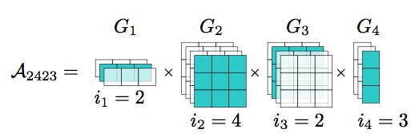

Frequently asked questions
==========================

What is *tensor* anyway?
------------------------
For most purposes, tensor is just a multidimensional array. For example, a matrix is a 2-dimensional array.

How to convert large scale tensors into the TT-format
-----------------------------------------------------
For small tensors, you can directly convert them into the TT-format by an SVD-based algorithm (e.g. with `t3f.to_tt_tensor`). For large tensor that do not fit to memory there are two ways: either try to approximate the TT-format by sampling a fraction of the tensor elements (see `TT-cross`_) or express your tensor analytically. For example, sometimes tensors can be expressed as arithmetic operations of simpler tensors, and for some functions (e.g. `exp` or `sin`) there are analytical expressions for the TT-format of their values on a grid.

.. _TT-cross: https://www.sciencedirect.com/science/article/pii/S0024379509003747

What do people do with this *Tensor Train* format?
--------------------------------------------------
In machine learning, TT-format is used for compressing neural network layers (`fully-connected`_, convolutional_, recurrent_), speeding up `training of Gaussian processes`_, theoretical analysis of expressive power of Recurrent Neural Networks (one_ and two_), `reinforcement learning`_, etc. See an `overview paper`_ for more information.

TT-format is also known in physics community under the name of Matrix Product State (MPS) and is extensively used.

.. _fully-connected: https://arxiv.org/abs/1509.06569

.. _convolutional: https://arxiv.org/abs/1611.03214

.. _recurrent: https://arxiv.org/abs/1707.01786

.. _training of Gaussian processes: https://arxiv.org/abs/1710.07324

.. _one: https://arxiv.org/abs/1711.00811

.. _two: https://openreview.net/forum?id=r1gNni0qtm

.. _reinforcement learning: https://arxiv.org/abs/1611.04706

.. _overview paper: https://arxiv.org/abs/1609.00893

Are there other tensor decompositions?
-------------------------------------
Yes! Most notable there are Canonical decomposition, Tucker, and Hierarchical Tucker decompositions. They all have their pros and cons, for instance many operations for Canonical decomposition are NP-hard; Tucker decomposition scales exponentially with the dimensionality of the tensor (and thus is inaplicable to tensors of dimensionality > 40). Hierarchical Tucker is very similar to TT-decomposition.

Where can I read more about this *Tensor Train* format?
-------------------------------------------------------
Look at the `paper`_ that proposed it. You can also check out my (Alexander Novikov's) slides_, from slide 3 to 14.

.. _slides: http://www.slideshare.net/AlexanderNovikov8/tensor-train-decomposition-in-machine-learning

.. _paper: https://www.researchgate.net/publication/220412263_Tensor-Train_Decomposition

By the way, train means like actual train, with wheels. The name comes from the pictures like the one below that illustrate the Tensor Train format and naturally look like a train (at least they say so).

